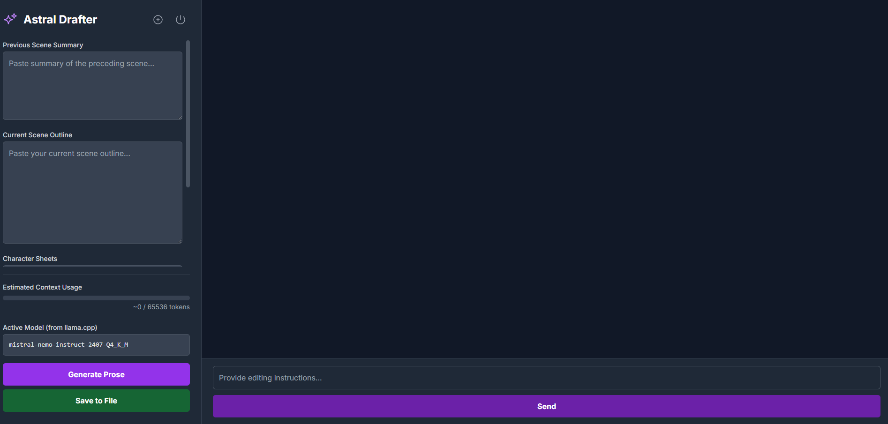

# **🚀 Astral-Drafter**

*A lean, local-first drafting tool for creative writers, powered by a custom GUI and a high-performance C++ inference engine.*

• Getting Started

• Tech Stack 

• Usage

• Acknowledgements

## **📋 Overview**

**Astral-Drafter** is a purpose-built, local-first application designed to accelerate the creative writing process. It combines a minimalist web-based GUI with a high-speed, locally-run LLM server, providing a powerful and private environment for drafting prose.

This tool was created to overcome the limitations and overhead of generic AI tools, offering a streamlined workflow for writers who need maximum control and performance. The system is designed to handle very large contexts (64k+), allowing for entire scenes and character notes to be processed for superior narrative consistency.

### **Key Features (v0.1)**

* **📝 Purpose-Built UI**: A clean, single-page web interface for pasting context, outlines, and character sheets.  
* **🚀 High-Speed Generation**: Leverages llama.cpp for native performance and GPU acceleration.  
* **💾 Auto-Save to File**: Generated prose is automatically saved to a user-specified file path.  
* **🔒 100% Local & Private**: No data ever leaves your machine.  
* **👆 One-Click Launch**: A simple batch script starts all necessary components.  
* **💬 Conversational Editing**: After the initial draft, you can provide follow-up instructions to refine and rewrite the text.

## **✨ Screenshot (v0.1)**

## **⚙️ Technology Stack & Workflow**

This project is built on a lean, high-performance stack, ensuring maximum efficiency by avoiding heavy frameworks and communicating directly with a native inference engine.

* **Inference Engine: llama.cpp Server**  
  * Runs quantized GGUF models (e.g., Mistral-Nemo @ 64k context).  
  * Provides near-native speed via C++ and GPU offloading (\--n-gpu-layers).  
  * Exposes an OpenAI-compatible API endpoint for easy integration.  
* **Backend Bridge: Custom Python Server (llama\_cpp\_server\_bridge.py)**  
  * Built with Python 3's native http.server for zero external framework bloat.  
  * Acts as middleware, receiving requests from the GUI and communicating with the llama.cpp server.  
  * Handles all file system operations (creating directories, writing/overwriting scene files).  
* **Frontend GUI: Single-File Web App (astral\_nexus\_drafter.html)**  
  * Vanilla HTML, CSS, and JavaScript, ensuring no complex build steps are needed.  
  * Styled with [Tailwind CSS](https://tailwindcss.com/) for a modern, responsive UI.  
  * Communicates directly with the Python bridge server.  
* **Launcher: Windows Batch Script (launch\_astral\_drafter.bat)**  
  * Provides a "one-click" desktop experience.  
  * Automates the startup of both the llama.cpp and Python bridge servers, then launches the GUI in the default browser.

## **🚀 Installation & Setup**

### **Prerequisites**

* Windows Operating System  
* Python 3.8+ installed  
* Git for cloning the repository  
* A pre-compiled version of llama.cpp's server.exe.  
* A GGUF-formatted LLM file (e.g., Mistral-Nemo).

### **Installation**

1. **Clone your repository**

# Replace YOUR\_GITHUB\_USERNAME with your actual GitHub username  
git clone \[https://github.com/YOUR\_GITHUB\_USERNAME/Astral-Drafter.git\](https://github.com/YOUR\_GITHUB\_USERNAME/Astral-Drafter.git)  
cd Astral-Drafter

2.   
3. **Install Python Dependencies**

pip install \-r requirements.txt

4.   
5. **Configure the Launcher**  
   * Open launch\_astral\_drafter.bat in a text editor.  
   * Update the placeholder paths at the top of the file to point to your llama.cpp directory, your model file, and this project's directory.

## **🖱️ Usage**

1. Double-click the launch\_astral\_drafter.bat file (or a desktop shortcut pointing to it).  
2. Two terminal windows will open for the servers, and the GUI will launch in your browser.  
3. In the GUI, paste your context, outline, and character sheets into the text boxes on the left.  
4. Specify an absolute file path for the output (e.g., D:\\Novels\\scene\_03.txt).  
5. Click **"Start Scene"** to generate the first draft.  
6. Once generated, use the chat input at the bottom to provide editing instructions. Each new generation will overwrite the file.  
7. When finished, click the red **Shutdown** button in the GUI to close both server windows cleanly.

## **🙏 Acknowledgements**

This project was built on the foundation of the excellent [mcp-ollama\_server](https://www.google.com/search?q=https://github.com/sethuram2003/mcp-ollama_server) by Sethuram. While this project has since been adapted to communicate directly with a llama.cpp server, the initial modular concept provided the inspiration.
